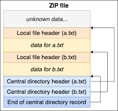

# CDR BLOG POST

Content Disarm and Reconstruction (CDR) is a technology that removes potentially malicious threats from files. A common place application of CDR tools is scanning incoming email attachments, such as Microsoft Office documents or PDFs, for malware. The tool may deconstruct and analyze the file, remove parts of the file deemed suspicious, and then reconstruct the file with the remaining pieces. This process ensures that only safe and sanitized content reaches the end-user, significantly reducing the risk of malware infections. 

The D3FEND team has started modeling components of the Content Disarm and Reconstruction pipeline. This blog post will detail the methodology and reasoning we used and depict our resulting model with D3FEND's CAD tool. By doing so, we aim to provide a comprehensive framework that can be utilized by cybersecurity professionals to enhance their understanding and implementation of CDR techniques.

## A Brief Introduction to CAD

The new D3FEND CAD tool is being developed by the D3FEND team to support modeling and graphing use cases. The tool lets you easily drag and drop nodes to represent ATT&CK and D3FEND techniques, digital artifacts, and more, which can be populated with a specific class such as d3f:WebApplicationFirewall. Additionally, edges can be drawn between nodes to represent relationships between classes, and the options are prepopulated with relationships currently defined in D3FEND.  CAD harnesses the power of the D3FEND ontology to perform automated reasoning on certain types of nodes. For example, from a single digital artifact node, users can then see what offensive and defensive techniques are related to that node, as well as the full set of class inferences for that digital artifact, and vice versa. This feature allows users to explore complex relationships and dependencies within cybersecurity scenarios, offering deeper insights into potential vulnerabilities and mitigation strategies. We hope that this tool can be used to aid the visual representation of a wide array of use cases, with different levels of granularity, from modeling a full adversary campaign to a malware sample. For more information, check out d3fend.mitre.org/cad and click help for documentation.

## Methodology

Like the rest of the content within D3FEND, we utilized numerous sources of research and patent literature to gather information about specific techniques utilized in CDR technology at a detailed technical level. While doing so, we kept techniques that were cybersecurity-related and excluded those that were not, such as physical techniques. We then abstracted techniques into a Content Filtering (d3f:ContentFiltering) taxonomy before diving into defining digital artifacts associated with the techniques. While the existing D3FEND ontology had some relevant digital artifacts, this work required additional artifacts to be added to the ontology. Finally, we defined precise relationships between the artifacts themselves and the techniques. As a result, we have added 14 new techniques and 43 new digital artifacts to the D3FEND framework.

#### Challenges

While there are countless vendors offering CDR products, due to the confidential nature of its applications and the competitive vendor landscape, it is quite challenging to research what specific CDR techniques the products use. The information available on vendor websites is vague and there aren't many patents in this space, likely because vendors want to keep their propriety knowledge confidential. In summary, open-source knowledge on CDR is neither in-depth nor easily accessible, but that is a problem this work attempts to solve.

## Deconstructing CDR

<html lang="en">
  <head>
    <meta charset="UTF-8" />
    <meta http-equiv="X-UA-Compatible" content="IE=edge" />
    <meta name="viewport" content="width=device-width, initial-scale=1.0" />
    <title>D3FEND Filtering Techniques</title>
    
    
  </head>
  <main>
    

      <section class="content"><h1 class="text-left"></h1> 

 

Orgs
 

 

Invalid Date
 

 
 

Author
 
<em class="font-large"></em>

 
<b>References:</b> 

 

</section>
    

    <iframe
      id="iframe"
      src="https://next.d3fend.mitre.org/cad-frame/"
      title="D3FEND CAD Embedded Filtering"
    ></iframe>
  </main>
</html>

Content Disarm and Reconstruction (CDR) is not listed as a D3FEND technique as it is composite; that is, it is composed of a series of techniques in a pipeline:​

- verification​
- content extraction & inspection​
- sanitization​
- augmentation​
- reconstruction

Among these discrete steps outlined above, some steps are not specifically security related. Specifically, a CDR tool may deconstruct and then reconstruct content regardless of it being infected or not. Additionally, the atomic steps of deconstruction and reconstruction does not inherently improve the security of the content in a useful way. Thus, we have focused on the intermediate filtering step that encompasses validating and altering the content so that the output after the entire CDR process is a sanitized version. The key is that all sub-techniques of Content Filtering (d3f:ContentFiltering) focus on ensuring compliance of a specific security-focused Content Policy (d3f:ContentPolicy).  Content Filtering is separated into three sub-techniques: Content Validation (d3f:ContentValidation) checks if the content adheres to the security policy, Content Transformation (d3f:ContentTransformation) modifies the content to a state of compliance, whether by removing, replacing, or converting, and then finally, there is an option to quarantine non-compliant content. This structured approach allows for flexibility and adaptability in handling diverse content types and security requirements.

## File Format Verification Deep Dive

<html lang="en">
  <head>
    <meta charset="UTF-8" />
    <meta http-equiv="X-UA-Compatible" content="IE=edge" />
    <meta name="viewport" content="width=device-width, initial-scale=1.0" />
    <title>D3FEND EMBEDDED FILE FORMAT VERIFICATION</title>
    
  </head>
  <main>
    <iframe
      id="iframe2"
      src="https://next.d3fend.mitre.org/cad-frame/"
      title="D3FEND EMBEDDED FILE FORMAT VERIFICATION"
    ></iframe>
  </main>
</html>

File Format Verification (d3f:FileFormatVerification) is an important step during Content Validation that safeguards against adversaries masquerading file types (T1036). We wanted to expand on that and provide a few specific techniques to verify file formats with greater technical detail. When researching, we could not find many academic or patent literature from vendor sources in a strict CDR context, but there are published papers related to this in the digital forensic space of file carving. The most common way to verify a file is File Magic Byte Verification (d3f:FileMagicByteVerification), checking that the magic number matches the declared file type. This technique is fundamental in ensuring that files are not misrepresented, which is a common tactic used by adversaries to bypass security measures. The other techniques listed, such as File Entropy Anomaly Detection (d3f:FileEntropyAnomalyDetection), involve more complex procedures. These advanced techniques provide additional layers of security by identifying anomalies that may indicate malicious intent as it is possible for an adversary to spoof the magic number.

## Creating Digital Artifacts

<html lang="en">
  <head>
    <meta charset="UTF-8" />
    <meta http-equiv="X-UA-Compatible" content="IE=edge" />
    <meta name="viewport" content="width=device-width, initial-scale=1.0" />
    <title>D3FEND EMBEDDED</title>
    
  </head>
  <main>
    <iframe
      id="iframe3"
      src="https://next.d3fend.mitre.org/cad-frame/"
      title="D3FEND CAD Embedded"
    ></iframe>
  </main>
</html>

Generating new CDR techniques provided an opportunity to expand the digital artifact ontology. Specifically, while the File (d3f:File) and File Section (d3f:FileSection) artifacts already existed, we've expanded File Section to include the following subclasses to allow more detailed and accurate modeling of file structures: File Header Block (d3f:FileHeaderBlock), File Content Block (d3f:FileContentBlock), and File Footer Block (d3f:FileFooterBlock). The header and footer blocks may contain a signature and additional content, which are types of file metadata; the content block will contain the block's data but may also include some metadata as well, depending on the file format. These artifacts aim to allow any file type to be modeled abstractly. For example, a zip file format can be shown as follows:

With our artifacts, the local file headers and central directory headers are represented by d3f:FileHeaderBlock, where the value of d3f:FileHeaderBlockSignature of the local file headers is 0x504b0304 and the value of the central directory headers is 0x504b0102, according to the zip file format specifications. The data that serve as the data of the zipped files is represented by d3f:FileContentBlockData. Finally, the end of the central directory record is a d3f:FileFooterBlock whose d3f:FileFooterBlockSignature is 0x503b0506. We've provided examples of modeling a PDF and a PE32 file within the notes of the diagram as well.  These examples demonstrate the versatility and applicability of our expanded ontology across different file types and use cases.

## Conclusion

The full, holistic diagram of our CDR work can be found in the CAD diagram below. 

We hope that this blog post shares our insights into our research on CDR techniques and artifacts, as well as provides an introduction to D3FEND's new CAD tool. We believe that this work represents a significant step forward in the understanding and application of CDR technologies. We would love to receive the cybersecurity community's feedback through our GitHub page (XXX). 

<html lang="en">
  <head>
    <meta charset="UTF-8" />
    <meta http-equiv="X-UA-Compatible" content="IE=edge" />
    <meta name="viewport" content="width=device-width, initial-scale=1.0" />
    <title>D3FEND EMBEDDED</title>
    <script>
      const whole = {
        "nodes": [
        {
            "id": "0.7032304012631014",
            "type": "countermeasure-node",
            "position": {
                "x": -857.5303808023284,
                "y": 697.7267173705943
            },
            "data": {
                "label": " Content Filtering",
                "sequence": "0",
                "user_properties": [],
                "d3f_class": ":ContentFiltering",
                "d3f_class_label": " Content Filtering"
            },
            "origin": [
                0.5,
                0
            ],
            "measured": {
                "width": 444,
                "height": 235
            },
            "selected": false,
            "dragging": false,
            "width": 444,
            "height": 235
        },
        {
            "id": "0.47249815289283914",
            "type": "countermeasure-node",
            "position": {
                "x": -195.23741329825498,
                "y": 351.2461274778274
            },
            "data": {
                "label": "Content Validation",
                "sequence": "0",
                "user_properties": [
                    [
                        "d3f:definition",
                        "Verify and validate contents complies with policy"
                    ],
                    [
                        "reference",
                        "https://patentimages.storage.googleapis.com/ba/10/83/968a6345eee505/US20200104494A1.pdf"
                    ]
                ],
                "d3f_class": ":ContentValidation",
                "d3f_class_label": "Content Validation"
            },
            "origin": [
                0.5,
                0
            ],
            "measured": {
                "width": 462,
                "height": 177
            },
            "selected": true,
            "dragging": false,
            "zIndex": 10
        },
        {
            "id": "9-copy0.9142249922179582",
            "type": "countermeasure-node",
            "position": {
                "x": -187.97985223673362,
                "y": 749.7585033657504
            },
            "data": {
                "label": "Content Modification",
                "sequence": "0",
                "user_properties": [
                    [
                        "d3f:definition",
                        "Modify content that does not comply with policy"
                    ],
                    [
                        "reference",
                        "https://patentimages.storage.googleapis.com/a9/40/78/713c8deb2c4c7a/US20190268352A1.pdf"
                    ]
                ],
                "d3f_class": ":ContentModification",
                "d3f_class_label": ":ContentModification"
            },
            "origin": [
                0.5,
                0
            ],
            "measured": {
                "width": 462,
                "height": 138
            },
            "selected": false,
            "dragging": false,
            "width": 409,
            "height": 138
        },
        {
            "id": "0.48426736445356067",
            "type": "countermeasure-node",
            "position": {
                "x": -211.89694327871774,
                "y": 1151.7744727473364
            },
            "data": {
                "label": "Content Quarantine",
                "sequence": "0",
                "user_properties": [
                    [
                        "d3f:definition",
                        "Transfer content that does not comply with policy to quanrantine zone"
                    ],
                    [
                        "reference",
                        "https://patentimages.storage.googleapis.com/a9/40/78/713c8deb2c4c7a/US20190268352A1.pdf"
                    ]
                ],
                "d3f_class": ":ContentQuarantine",
                "d3f_class_label": "Content Quarantine"
            },
            "origin": [
                0.5,
                0
            ],
            "measured": {
                "width": 474,
                "height": 177
            },
            "selected": false,
            "dragging": false,
            "width": 474,
            "height": 177
        },
        {
            "id": "0.5762349378605824",
            "type": "countermeasure-node",
            "position": {
                "x": 397.8581120342072,
                "y": 960.0629696433737
            },
            "data": {
                "label": "Content Format Conversion",
                "sequence": "0",
                "user_properties": [
                    [
                        "d3f:definition",
                        "Converting a file from one form to another, usually a simpler and safer format"
                    ],
                    [
                        "reference",
                        "https://patentimages.storage.googleapis.com/a9/40/78/713c8deb2c4c7a/US20190268352A1.pdf"
                    ]
                ],
                "d3f_class": ":ContentFormatConversion",
                "d3f_class_label": "Content Format Conversion"
            },
            "origin": [
                0.5,
                0
            ],
            "measured": {
                "width": 462,
                "height": 177
            },
            "selected": false,
            "dragging": false
        },
        {
            "id": "0.7617608511325669",
            "type": "countermeasure-node",
            "position": {
                "x": 391.5106807208549,
                "y": 475.73880343180383
            },
            "data": {
                "label": "Content Excision",
                "sequence": "0",
                "user_properties": [
                    [
                        "d3f:definition",
                        "Removing specific, potentially malicious, parts of content"
                    ],
                    [
                        "reference",
                        "https://patentimages.storage.googleapis.com/a9/40/78/713c8deb2c4c7a/US20190268352A1.pdf"
                    ]
                ],
                "d3f_class": ":ContentExcision",
                "d3f_class_label": "Content Excision"
            },
            "origin": [
                0.5,
                0
            ],
            "measured": {
                "width": 462,
                "height": 177
            },
            "selected": false,
            "dragging": false
        },
        {
            "id": "0.0744514779826817",
            "type": "countermeasure-node",
            "position": {
                "x": 400.57812340419486,
                "y": 734.8401421747034
            },
            "data": {
                "label": "Content Substitution",
                "sequence": "0",
                "user_properties": [
                    [
                        "d3f:definition",
                        "Replace specific parts of content with something else"
                    ],
                    [
                        "reference",
                        "https://patentimages.storage.googleapis.com/a9/40/78/713c8deb2c4c7a/US20190268352A1.pdf"
                    ]
                ],
                "d3f_class": ":ContentSubstitution",
                "d3f_class_label": "Content Substitution"
            },
            "origin": [
                0.5,
                0
            ],
            "measured": {
                "width": 462,
                "height": 177
            },
            "selected": false,
            "dragging": false
        },
        {
            "id": "0.5507247954821324",
            "type": "artifact-node",
            "position": {
                "x": 2738.2911589668497,
                "y": 158.66995602974254
            },
            "data": {
                "label": "File Section",
                "sequence": "0",
                "user_properties": [],
                "d3f_class": "d3f:FileSection",
                "d3f_class_label": "File Section"
            },
            "origin": [
                0.5,
                0
            ],
            "measured": {
                "width": 356,
                "height": 148
            },
            "selected": false,
            "dragging": false,
            "width": 356,
            "height": 148
        },
        {
            "id": "0.28963955228702054",
            "type": "artifact-node",
            "position": {
                "x": 4516.572622184261,
                "y": -92.8573519215963
            },
            "data": {
                "label": "File Magic Bytes",
                "sequence": "0",
                "user_properties": [
                    [
                        "definition",
                        "A specific type of header signature located at the beginning of a file, used to identify the file format."
                    ]
                ],
                "d3f_class": ":FileMagicBytes",
                "d3f_class_label": "File Magic Bytes"
            },
            "origin": [
                0.5,
                0
            ],
            "measured": {
                "width": 462,
                "height": 107
            },
            "selected": false,
            "dragging": false,
            "width": 207,
            "height": 107
        },
        {
            "id": "0.0490499135274598",
            "type": "artifact-node",
            "position": {
                "x": 3303.949438561061,
                "y": -184.19381463278728
            },
            "data": {
                "label": "File Header Block",
                "sequence": "0",
                "user_properties": [
                    [
                        "definition",
                        "Headers are sections of a file that organize and provide information about specific sections or components of the file. Typically found at the beginning of a file, they often contain file type identification, version information, and metadata such as size, format, and encoding."
                    ]
                ],
                "d3f_class": ":FileHeaderBlock",
                "d3f_class_label": "File Header Block"
            },
            "origin": [
                0.5,
                0
            ],
            "measured": {
                "width": 462,
                "height": 102
            },
            "selected": false,
            "dragging": false,
            "width": 309,
            "height": 102
        },
        {
            "id": "0.1230247439051928",
            "type": "artifact-node",
            "position": {
                "x": 3297.6336863032166,
                "y": 161.6435723258549
            },
            "data": {
                "label": "File Content Block",
                "sequence": "0",
                "user_properties": [
                    [
                        "definition",
                        "A section within a file that contains the main content or data payload."
                    ]
                ],
                "d3f_class": ":FileContentBlock",
                "d3f_class_label": "File Content Block"
            },
            "origin": [
                0.5,
                0
            ],
            "measured": {
                "width": 462,
                "height": 134
            },
            "selected": false,
            "dragging": false
        },
        {
            "id": "-copy0.23195137482463135",
            "type": "artifact-node",
            "position": {
                "x": 1796.338245642954,
                "y": 1261.7692614436212
            },
            "data": {
                "label": "File Metadata",
                "sequence": "0",
                "user_properties": [
                    [
                        "definition",
                        "Information that describes and provides context about a file's content, structure, and attributes."
                    ]
                ],
                "d3f_class": ":FileMetadata",
                "d3f_class_label": "File Metadata"
            },
            "origin": [
                0.5,
                0
            ],
            "measured": {
                "width": 462,
                "height": 148
            },
            "selected": false,
            "dragging": false
        },
        {
            "id": "0.34302096991368103",
            "type": "artifact-node",
            "position": {
                "x": 3907.8163768423506,
                "y": -294.5020661272177
            },
            "data": {
                "label": "File Header Block Content",
                "sequence": "0",
                "user_properties": [
                    [
                        "definition",
                        "The content of a header block not including the signature."
                    ]
                ],
                "d3f_class": ":FileHeaderBlockContent",
                "d3f_class_label": "File Header Block Content"
            },
            "origin": [
                0.5,
                0
            ],
            "measured": {
                "width": 462,
                "height": 134
            },
            "selected": false,
            "dragging": false
        },
        {
            "id": "0.09325736548375141",
            "type": "artifact-node",
            "position": {
                "x": 3918.0563337197877,
                "y": 255.08403653645013
            },
            "data": {
                "label": "File Content Block Metadata",
                "sequence": "0",
                "user_properties": [
                    [
                        "definition",
                        "Content Blocks may contain metadata specific to the block's content at the beginning"
                    ]
                ],
                "d3f_class": ":FileContentBlockMetadata",
                "d3f_class_label": "File Content Block Metadata"
            },
            "origin": [
                0.5,
                0
            ],
            "measured": {
                "width": 462,
                "height": 134
            },
            "selected": false,
            "dragging": false
        },
        {
            "id": "0.30470669924201865",
            "type": "artifact-node",
            "position": {
                "x": 3911.9430224696885,
                "y": 87.88827897265487
            },
            "data": {
                "label": "File Content Block Data",
                "sequence": "0",
                "user_properties": [
                    [
                        "definition",
                        "The actual content or main data within a file or data block."
                    ]
                ],
                "d3f_class": ":FileContentBlockData",
                "d3f_class_label": "File Content Block Data"
            },
            "origin": [
                0.5,
                0
            ],
            "measured": {
                "width": 462,
                "height": 134
            },
            "selected": false,
            "dragging": false
        },
        {
            "id": "0.40552351868555836",
            "type": "countermeasure-node",
            "position": {
                "x": 401.3630579050854,
                "y": 191.08996428562648
            },
            "data": {
                "label": "File Format Verification",
                "sequence": "0",
                "user_properties": [
                    [
                        "d3f:definition",
                        "verifying that a file conforms to its expected format specifications"
                    ],
                    [
                        "reference",
                        "https://patentimages.storage.googleapis.com/ba/10/83/968a6345eee505/US20200104494A1.pdf"
                    ]
                ],
                "d3f_class": ":FileFormatVerification",
                "d3f_class_label": "File Format Verification"
            },
            "origin": [
                0.5,
                0
            ],
            "measured": {
                "width": 462,
                "height": 177
            },
            "selected": false,
            "dragging": false
        },
        {
            "id": "0.6146071780317519",
            "type": "artifact-node",
            "position": {
                "x": 2248.310678345612,
                "y": 481.97133405554365
            },
            "data": {
                "label": "File",
                "sequence": "0",
                "user_properties": [],
                "d3f_class": "d3f:File",
                "d3f_class_label": "File"
            },
            "origin": [
                0.5,
                0
            ],
            "measured": {
                "width": 241,
                "height": 113
            },
            "selected": false,
            "dragging": false,
            "width": 241,
            "height": 113
        },
        {
            "id": "0.7314564313202583",
            "type": "artifact-node",
            "position": {
                "x": 1796.273377670382,
                "y": 801.3286046642634
            },
            "data": {
                "label": "Content Policy",
                "sequence": "0",
                "user_properties": [
                    [
                        "definition",
                        "A set of rules and guidelines that dictate the acceptable use, distribution, and management of digital content within a system or platform. It defines what content is allowed, restricted, or prohibited, ensuring compliance with legal, ethical, and organizational standards."
                    ]
                ],
                "d3f_class": ":ContentPolicy",
                "d3f_class_label": "Content Policy"
            },
            "origin": [
                0.5,
                0
            ],
            "measured": {
                "width": 462,
                "height": 190
            },
            "selected": false,
            "dragging": false
        },
        {
            "id": "0.7752203564382074",
            "type": "note-node",
            "position": {
                "x": 3286.4618550418118,
                "y": 1020.6772720465565
            },
            "data": {
                "label": "",
                "sequence": "0",
                "user_properties": [
                    [
                        "rdfs:comment",
                        "Includes Enclosed Docs, Scripts, Macros, Images, Video, Embedded Obj, Hyperlink, forms"
                    ]
                ]
            },
            "origin": [
                0.5,
                0
            ],
            "measured": {
                "width": 493,
                "height": 75
            },
            "selected": false,
            "dragging": false,
            "width": 454,
            "height": 75
        },
        {
            "id": "0.1189036182761879",
            "type": "artifact-node",
            "position": {
                "x": 2450.550841743567,
                "y": 1393.8063044715798
            },
            "data": {
                "label": "Structured Digital Information Content",
                "sequence": "0",
                "user_properties": [
                    [
                        "definition",
                        "Structured Digital Information Content refers to user data to be consumed by the user that is organized in a predefined format, making it easily searchable and analyzable. This type of content typically follows a specific schema or model, allowing for efficient data processing and retrieval."
                    ]
                ],
                "d3f_class": ":StructuredDigitalInformationContent",
                "d3f_class_label": "Structured Digital Information Content"
            },
            "origin": [
                0.5,
                0
            ],
            "measured": {
                "width": 462,
                "height": 188
            },
            "selected": false,
            "dragging": false,
            "width": 460,
            "height": 188
        },
        {
            "id": "0.34945809922391347",
            "type": "countermeasure-node",
            "position": {
                "x": 1344.7047643906185,
                "y": -1554.1031561869686
            },
            "data": {
                "label": "File Metadata Value Verification",
                "sequence": "0",
                "user_properties": [
                    [
                        "d3f:definition",
                        "The process of checking specific static values within a file, such as file signatures or magic numbers, to ensure they match the expected values defined by the file format specification."
                    ],
                    [
                        "reference",
                        "https://core.ac.uk/download/pdf/326762883.pdf"
                    ],
                    [
                        "reference",
                        "https://www.sciencedirect.com/science/article/pii/S1742287607000369?viewFullText=true#sec4"
                    ],
                    [
                        "description",
                        "File format specifications often define expected values for specific fields. A common example are file signatures, or magic numbers, which are used to quickly identify files. Another example is within the Compound Document Header of Microsoft Office files, the 29th and 30th byte identifies the byte order, specifically 0xFFFE for little-endian. This technique verifies that the file's static values match the values of the declared file format's specification."
                    ]
                ],
                "d3f_class": ":FileMetadataValueVerification",
                "d3f_class_label": ":FileMetadataValueVerification"
            },
            "origin": [
                0.5,
                0
            ],
            "measured": {
                "width": 462,
                "height": 367
            },
            "selected": false,
            "dragging": false,
            "zIndex": 10
        },
        {
            "id": "0.3258831965382004",
            "type": "countermeasure-node",
            "position": {
                "x": 2150.6024960121717,
                "y": -1329.7768792538236
            },
            "data": {
                "label": "File Magic Byte Verification",
                "sequence": "0",
                "user_properties": [
                    [
                        "d3f:definition",
                        "Utilizing the magic number to verify the file"
                    ],
                    [
                        "reference",
                        "https://pure.uva.nl/ws/files/1739225/132135_thesis.pdf"
                    ],
                    [
                        "reference",
                        "https://www.sciencedirect.com/science/article/pii/S1742287607000369?viewFullText=true#sec4"
                    ]
                ],
                "d3f_class": ":FileMagicByteVerification",
                "d3f_class_label": "File Magic Byte Verification"
            },
            "origin": [
                0.5,
                0
            ],
            "measured": {
                "width": 462,
                "height": 195
            },
            "selected": false,
            "dragging": false,
            "zIndex": 10
        },
        {
            "id": "0.9774559813293479",
            "type": "countermeasure-node",
            "position": {
                "x": 1350.964382416417,
                "y": -1143.7634028638533
            },
            "data": {
                "label": "File Internal Structure Verification",
                "sequence": "0",
                "user_properties": [
                    [
                        "d3f:definition",
                        "The process of checking specific static values within a file, such as file signatures or magic numbers, to ensure they match the expected values defined by the file format specification."
                    ],
                    [
                        "reference",
                        "https://www.sciencedirect.com/science/article/pii/S1742287607000369?viewFullText=true#sec4"
                    ],
                    [
                        "reference",
                        "https://pure.uva.nl/ws/files/1739225/132135_thesis.pdf"
                    ],
                    [
                        "description",
                        "File format specifications often define expected values for specific fields. A common example are file signatures, or magic numbers, which are used to quickly identify files. Another example is within the Compound Document Header of Microsoft Office files, the 29th and 30th byte identifies the byte order, specifically 0xFFFE for little-endian. This technique verifies that the file's static values match the values of the declared file format's specification."
                    ]
                ],
                "d3f_class": ":FileInternalStructureVerification",
                "d3f_class_label": ":FileInternalStructureVerification"
            },
            "origin": [
                0.5,
                0
            ],
            "measured": {
                "width": 462,
                "height": 381
            },
            "selected": false,
            "dragging": false,
            "zIndex": 10
        },
        {
            "id": "0.2756682259786878",
            "type": "countermeasure-node",
            "position": {
                "x": 1338.9555365511835,
                "y": -326.73032939559806
            },
            "data": {
                "label": "File Content Decompression Checking",
                "sequence": "0",
                "user_properties": [
                    [
                        "d3f:definition",
                        "Checking if compressed or encoded data sections can be successfully decompressed or decoded. Can follow with further analysis with semantic knowledge"
                    ],
                    [
                        "reference",
                        "https://www.sciencedirect.com/science/article/pii/S1742287607000369?viewFullText=true#sec4"
                    ],
                    [
                        "reference",
                        "https://pure.uva.nl/ws/files/1739225/132135_thesis.pdf"
                    ]
                ],
                "d3f_class": ":FileContentDecompressionChecking",
                "d3f_class_label": "File Content Decompression Checking"
            },
            "origin": [
                0.5,
                0
            ],
            "measured": {
                "width": 462,
                "height": 237
            },
            "selected": false,
            "dragging": false
        },
        {
            "id": "0.16229972296000217",
            "type": "countermeasure-node",
            "position": {
                "x": 1350.3754290479505,
                "y": -711.417088012538
            },
            "data": {
                "label": "File Metadata Consistency Validation",
                "sequence": "0",
                "user_properties": [
                    [
                        "d3f:definition",
                        "The process of validating the consistency between a file's metadata and its actual content, ensuring that elements like declared lengths, pointers, and checksums accurately describe the file's content."
                    ],
                    [
                        "reference",
                        "https://pure.uva.nl/ws/files/1739225/132135_thesis.pdf"
                    ],
                    [
                        "description",
                        "This technique involves validating the consistency between a file's metadata and its actual content. It checks elements like declared lengths, pointers, and checksums to ensure they accurately describe the file's content. For instance, if a header specifies a content block of 50 bytes, this should be verified, and CRC values should be recalculated and compared."
                    ]
                ],
                "d3f_class": ":FileMetadataConsistencyValidation",
                "d3f_class_label": ":FileMetadataConsistencyValidation"
            },
            "origin": [
                0.5,
                0
            ],
            "measured": {
                "width": 462,
                "height": 335
            },
            "selected": false,
            "dragging": false,
            "zIndex": 10
        },
        {
            "id": "0.20366737316992256",
            "type": "artifact-node",
            "position": {
                "x": 1787.19308955642,
                "y": 1500.8255290918723
            },
            "data": {
                "label": "Metadata",
                "sequence": "0",
                "user_properties": [],
                "d3f_class": "d3f:Metadata",
                "d3f_class_label": "Metadata"
            },
            "origin": [
                0.5,
                0
            ],
            "measured": {
                "width": 150,
                "height": 114
            },
            "selected": false,
            "dragging": false
        },
        {
            "id": "0.9672516677158717",
            "type": "artifact-node",
            "position": {
                "x": 3912.541234948633,
                "y": -111.2971259445954
            },
            "data": {
                "label": "File Header Block Signature",
                "sequence": "0",
                "user_properties": [
                    [
                        "definition",
                        "A sequence of bytes used to identify and validate specific header sections within a file."
                    ]
                ],
                "d3f_class": ":FileHeaderBlockSignature",
                "d3f_class_label": ":FileHeaderBlockSignature"
            },
            "origin": [
                0.5,
                0
            ],
            "measured": {
                "width": 462,
                "height": 134
            },
            "selected": false,
            "dragging": false
        },
        {
            "id": "0.14499280157174388",
            "type": "artifact-node",
            "position": {
                "x": 3294.0413515291857,
                "y": 541.1733411878436
            },
            "data": {
                "label": "File Footer Block",
                "sequence": "0",
                "user_properties": [
                    [
                        "definition",
                        "A section at the end of a file that contains metadata or control information."
                    ]
                ],
                "d3f_class": ":FileFooterBlock",
                "d3f_class_label": "File Footer Block"
            },
            "origin": [
                0.5,
                0
            ],
            "measured": {
                "width": 462,
                "height": 134
            },
            "selected": false,
            "dragging": false
        },
        {
            "id": "0.16090754731449974",
            "type": "artifact-node",
            "position": {
                "x": 2451.6665314645256,
                "y": 1638.7262179850063
            },
            "data": {
                "label": "Digital Information",
                "sequence": "0",
                "user_properties": [],
                "d3f_class": "d3f:DigitalInformation",
                "d3f_class_label": "Digital Information"
            },
            "origin": [
                0.5,
                0
            ],
            "measured": {
                "width": 159,
                "height": 114
            },
            "selected": false,
            "dragging": false
        },
        {
            "id": "0.270595913540307",
            "type": "artifact-node",
            "position": {
                "x": 3898.628014033057,
                "y": 684.4599586502709
            },
            "data": {
                "label": "File Footer Block Content",
                "sequence": "0",
                "user_properties": [
                    [
                        "definition",
                        "The content of a footer block not including the signature."
                    ]
                ],
                "d3f_class": ":FileFooterBlockContent",
                "d3f_class_label": "File Footer Block Content"
            },
            "origin": [
                0.5,
                0
            ],
            "measured": {
                "width": 462,
                "height": 134
            },
            "selected": false,
            "dragging": false
        },
        {
            "id": "0.8253744550116549",
            "type": "note-node",
            "position": {
                "x": 4592.607395726958,
                "y": 1251.2552701335933
            },
            "data": {
                "label": "ZIP FILE",
                "sequence": "0",
                "user_properties": [
                    [
                        "rdfs:comment",
                        "Example zip file\n\n1. Local File Header A.txt\n2. Data for A.txt\n3. Local File Header B.txt\n4. Data for B.txt\n5. Central Directory Header A.txt\n6. Central Directory Header B.txt\n7. End of central directory record\n\n\n\n\n1. Header Block\n        header signature: 0x504b0304\n2. Content Block\n3. Header Block\n        header signature: 0x504b0304\n4. Content Block\n5. Header Block\n        header signature: 0x504b0102\n6. Header Block\n        header signature: 0x504b0102\n\n7. Footer Block\n       footer signature: 0x503b0506\n"
                    ]
                ]
            },
            "origin": [
                0.5,
                0
            ],
            "measured": {
                "width": 242,
                "height": 541
            },
            "selected": false,
            "dragging": false,
            "width": 242,
            "height": 541
        },
        {
            "id": "0.6136178162729569",
            "type": "artifact-node",
            "position": {
                "x": 3907.1174509129846,
                "y": 493.76922414518896
            },
            "data": {
                "label": "File Footer Block Signature",
                "sequence": "0",
                "user_properties": [
                    [
                        "definition",
                        "A sequence of bytes used to identify and validate the footer section within a file."
                    ]
                ],
                "d3f_class": ":FileFooterBlockSignature",
                "d3f_class_label": ":FileFooterBlockSignature"
            },
            "origin": [
                0.5,
                0
            ],
            "measured": {
                "width": 462,
                "height": 134
            },
            "selected": false,
            "dragging": false
        },
        {
            "id": "0.8199907918822567",
            "type": "note-node",
            "position": {
                "x": 4891.871454331573,
                "y": 1254.1370835834248
            },
            "data": {
                "label": "PDF FILE",
                "sequence": "0",
                "user_properties": [
                    [
                        "rdfs:comment",
                        "Example PDF file\n\n\n1. Header\n2. Body\n3. Cross Reference Table\n4. Trailer\n\n\n\n\n1. Header Block\n         header signature: %PDF-1.7\n2. Content Block\n3. Header Block\n          header signature: xref\n4. Footer Block\n          footer signature: trailer\n"
                    ]
                ]
            },
            "origin": [
                0.5,
                0
            ],
            "measured": {
                "width": 194,
                "height": 313
            },
            "selected": false,
            "dragging": false
        },
        {
            "id": "0.15630497336477822",
            "type": "note-node",
            "position": {
                "x": 5162.339067020135,
                "y": 1255.4976247141924
            },
            "data": {
                "label": "PE32",
                "sequence": "0",
                "user_properties": [
                    [
                        "rdfs:comment",
                        "Example PE file\n\n\n1. DOS Header\n2. DOS stub\n3. NTHeaders\n4. Section Table\n5. Sections (.text, .rdata, etc)\n\n\n1. Header Block\n2. Content Block\n3. Header Block\n4. Header Block\n5. Content Block\n\n\n"
                    ]
                ]
            },
            "origin": [
                0.5,
                0
            ],
            "measured": {
                "width": 219,
                "height": 273
            },
            "selected": false,
            "width": 219,
            "height": 273,
            "dragging": false
        },
        {
            "id": "0.5764862604479757",
            "type": "note-node",
            "position": {
                "x": 4097.568046120161,
                "y": 1252.709566784229
            },
            "data": {
                "label": "libmagic",
                "sequence": "0",
                "user_properties": [
                    [
                        "rdfs:comment",
                        "Libmagic has a custom domain specific language (DSL) for specifying file patterns\n\n- Located in /usr/local/share/misc/magic\n\n\nExample:\n\n10        lelong    0x00000100    this is a test\n>20       ubyte 0xFF       test two\n!:mime    application/x-foo\n\n\n1. Start at byte offset 10, read singed little-endian long, if equal to 0x100, print \"this is a test\"\n2. If test 1 is true, test if byte offset 20 equals 0xFF, print \"test two\", and associate file with MIME type application/x-foo\n\n\n\n"
                    ]
                ]
            },
            "origin": [
                0.5,
                0
            ],
            "measured": {
                "width": 640,
                "height": 253
            },
            "selected": false,
            "width": 640,
            "height": 253,
            "dragging": false
        },
        {
            "id": "0.1608709589078562",
            "type": "note-node",
            "position": {
                "x": 3971.397819321481,
                "y": 1541.0281689718718
            },
            "data": {
                "label": "TrID",
                "sequence": "0",
                "user_properties": [
                    [
                        "rdfs:comment",
                        "TrID has a database of XML files containing rules/patterns to match...\n\n\nUnable to see what the XML files themselves\n"
                    ]
                ]
            },
            "origin": [
                0.5,
                0
            ],
            "measured": {
                "width": 379,
                "height": 117
            },
            "selected": false,
            "dragging": false
        },
        {
            "id": "0.6808450084424931",
            "type": "attack-node",
            "position": {
                "x": 2793.950145035385,
                "y": -66.32891787068344
            },
            "data": {
                "label": "Office Template Macros",
                "sequence": "0",
                "user_properties": [],
                "d3f_class": "d3f:T1137.001"
            },
            "measured": {
                "width": 150,
                "height": 113
            },
            "zIndex": 10,
            "selected": false
        },
        {
            "id": "0.09910986957621404",
            "type": "attack-node",
            "position": {
                "x": 4955.487689370096,
                "y": -82.23175635099864
            },
            "data": {
                "label": "Masquerade File Type",
                "sequence": "0",
                "user_properties": [],
                "d3f_class": "d3f:T1036.008"
            },
            "measured": {
                "width": 150,
                "height": 113
            },
            "zIndex": 10,
            "selected": false
        },
        {
            "id": "0.9869569819632811",
            "type": "attack-node",
            "position": {
                "x": 4316.045605088414,
                "y": 73.79977020276513
            },
            "data": {
                "label": "Malicious Image",
                "sequence": "0",
                "user_properties": [],
                "d3f_class": "d3f:T1204.003"
            },
            "measured": {
                "width": 150,
                "height": 113
            },
            "selected": false,
            "dragging": false
        },
        {
            "id": "0.4556303405855364",
            "type": "attack-node",
            "position": {
                "x": 4385.9247550174005,
                "y": 160.90939545670685
            },
            "data": {
                "label": "Malicious Link",
                "sequence": "0",
                "user_properties": [],
                "d3f_class": "d3f:T1204.001"
            },
            "measured": {
                "width": 150,
                "height": 113
            },
            "selected": false,
            "dragging": false
        },
        {
            "id": "0.11473781863281762",
            "type": "attack-node",
            "position": {
                "x": 4464.419142608863,
                "y": 243.23277756482761
            },
            "data": {
                "label": "Embedded Payloads",
                "sequence": "0",
                "user_properties": [],
                "d3f_class": "d3f:T1027.009"
            },
            "measured": {
                "width": 150,
                "height": 113
            },
            "zIndex": 10,
            "selected": false,
            "dragging": false
        },
        {
            "id": "0.035945587722548966",
            "type": "vulnerability-node",
            "position": {
                "x": 1934.6690780762065,
                "y": 59.84049243098055
            },
            "data": {
                "label": "Cleartext Storage of Sensitive Information",
                "sequence": "0",
                "user_properties": [],
                "d3f_class": "d3f:CWE-312"
            },
            "measured": {
                "width": 337,
                "height": 83
            },
            "zIndex": 10,
            "selected": false,
            "width": 337,
            "height": 83
        },
        {
            "id": "0.6373118746457436",
            "type": "vulnerability-node",
            "position": {
                "x": 1828.3356111946912,
                "y": 154.6208321718074
            },
            "data": {
                "label": "Improper Removal of Sensitive Information Before Storage or Transfer",
                "sequence": "0",
                "user_properties": [],
                "d3f_class": "d3f:CWE-212"
            },
            "measured": {
                "width": 443,
                "height": 81
            },
            "zIndex": 10,
            "selected": false,
            "width": 443,
            "height": 81,
            "dragging": false
        },
        {
            "id": "0.0176150859463724",
            "type": "vulnerability-node",
            "position": {
                "x": 1931.3507611847324,
                "y": 256.91052335910183
            },
            "data": {
                "label": "Insertion of Sensitive Information Into Sent Data",
                "sequence": "0",
                "user_properties": [],
                "d3f_class": "d3f:CWE-201"
            },
            "measured": {
                "width": 337,
                "height": 83
            },
            "selected": false,
            "width": 337,
            "height": 83,
            "dragging": false
        },
        {
            "id": "0.18989037913866968",
            "type": "vulnerability-node",
            "position": {
                "x": 1083.9669679373612,
                "y": 1533.718016193416
            },
            "data": {
                "label": "Exposure of Sensitive Information Through Metadata",
                "sequence": "0",
                "user_properties": [],
                "d3f_class": "d3f:CWE-1230"
            },
            "measured": {
                "width": 351,
                "height": 98
            },
            "zIndex": 10,
            "selected": false,
            "width": 351,
            "height": 98
        },
        {
            "id": "0.3233797771654314",
            "type": "countermeasure-node",
            "position": {
                "x": 170.13278674828052,
                "y": 1207.4361003630295
            },
            "data": {
                "label": "Content Rebuild",
                "sequence": "0",
                "user_properties": [
                    [
                        "d3f:definition",
                        "Rebuild the file according to the spec so any unreferenced components or objects are removed."
                    ]
                ],
                "d3f_class": ":ContentRebuild"
            },
            "measured": {
                "width": 462,
                "height": 145
            },
            "selected": false,
            "dragging": false
        },
        {
            "id": "0.3184595035224653",
            "type": "countermeasure-node",
            "position": {
                "x": -1518.2887828827008,
                "y": 762.797282005339
            },
            "data": {
                "label": "Isolate",
                "sequence": "0",
                "user_properties": [],
                "d3f_class": "d3f:Isolate"
            },
            "measured": {
                "width": 150,
                "height": 113
            },
            "zIndex": 10,
            "selected": false,
            "dragging": false
        }
    ],
    "edges": [
        {
            "type": "editableEdge",
            "data": {
                "label": "d3f:may-contain",
                "d3f_property": "d3f:may-contain"
            },
            "markerEnd": {
                "type": "arrowclosed"
            },
            "source": "0.0490499135274598",
            "sourceHandle": "source",
            "target": "0.34302096991368103",
            "targetHandle": "target",
            "id": "xy-edge__0.0490499135274598source-0.34302096991368103target",
            "selected": false
        },
        {
            "type": "editableEdge",
            "data": {
                "label": "d3f:may-contain",
                "d3f_property": "d3f:may-contain"
            },
            "markerEnd": {
                "type": "arrowclosed"
            },
            "source": "0.1230247439051928",
            "sourceHandle": "source",
            "target": "0.09325736548375141",
            "targetHandle": "target",
            "id": "xy-edge__0.1230247439051928source-0.09325736548375141target",
            "selected": false
        },
        {
            "type": "editableEdge",
            "data": {
                "label": "contains",
                "d3f_property": "contains"
            },
            "markerEnd": {
                "type": "arrowclosed"
            },
            "source": "0.1230247439051928",
            "sourceHandle": "source",
            "target": "0.30470669924201865",
            "targetHandle": "target",
            "id": "xy-edge__0.1230247439051928source-0.30470669924201865target",
            "selected": false
        },
        {
            "type": "editableEdge",
            "data": {
                "label": "d3f:may-contain",
                "d3f_property": "d3f:may-contain",
                "d3f_class_label": "d3f:may-contain"
            },
            "markerEnd": {
                "type": "arrowclosed"
            },
            "source": "0.6146071780317519",
            "sourceHandle": "source",
            "target": "0.5507247954821324",
            "targetHandle": "target",
            "id": "xy-edge__0.6146071780317519source-0.5507247954821324target",
            "selected": false
        },
        {
            "type": "editableEdge",
            "data": {
                "label": "rdfs:subClassOf",
                "d3f_property": "rdfs:subClassOf"
            },
            "markerEnd": {
                "type": "arrowclosed"
            },
            "source": "0.0490499135274598",
            "sourceHandle": "source",
            "target": "0.5507247954821324",
            "targetHandle": "target",
            "id": "xy-edge__0.0490499135274598source-0.5507247954821324target",
            "selected": false
        },
        {
            "type": "editableEdge",
            "data": {
                "label": "rdfs:subClassOf",
                "d3f_property": "rdfs:subClassOf"
            },
            "markerEnd": {
                "type": "arrowclosed"
            },
            "source": "0.1230247439051928",
            "sourceHandle": "source",
            "target": "0.5507247954821324",
            "targetHandle": "target",
            "id": "xy-edge__0.1230247439051928source-0.5507247954821324target",
            "selected": false
        },
        {
            "type": "editableEdge",
            "data": {
                "label": "rdfs:subClassOf",
                "d3f_property": "rdfs:subClassOf"
            },
            "markerEnd": {
                "type": "arrowclosed"
            },
            "source": "0.34302096991368103",
            "sourceHandle": "source",
            "target": "-copy0.23195137482463135",
            "targetHandle": "target",
            "id": "xy-edge__0.34302096991368103source--copy0.23195137482463135target",
            "selected": false
        },
        {
            "type": "editableEdge",
            "data": {
                "label": "rdfs:subClassOf",
                "d3f_property": "rdfs:subClassOf"
            },
            "markerEnd": {
                "type": "arrowclosed"
            },
            "source": "0.09325736548375141",
            "sourceHandle": "source",
            "target": "-copy0.23195137482463135",
            "targetHandle": "target",
            "id": "xy-edge__0.09325736548375141source--copy0.23195137482463135target",
            "selected": false
        },
        {
            "type": "editableEdge",
            "data": {
                "label": "rdfs:subClassOf",
                "d3f_property": "rdfs:subClassOf"
            },
            "markerEnd": {
                "type": "arrowclosed"
            },
            "source": "0.47249815289283914",
            "sourceHandle": "source",
            "target": "0.7032304012631014",
            "targetHandle": "target",
            "id": "xy-edge__0.47249815289283914source-0.7032304012631014target",
            "selected": false
        },
        {
            "type": "editableEdge",
            "data": {
                "label": "rdfs:subClassOf",
                "d3f_property": "rdfs:subClassOf"
            },
            "markerEnd": {
                "type": "arrowclosed"
            },
            "source": "9-copy0.9142249922179582",
            "sourceHandle": "source",
            "target": "0.7032304012631014",
            "targetHandle": "target",
            "id": "xy-edge__9-copy0.9142249922179582source-0.7032304012631014target",
            "selected": false
        },
        {
            "type": "editableEdge",
            "data": {
                "label": "rdfs:subClassOf",
                "d3f_property": "rdfs:subClassOf"
            },
            "markerEnd": {
                "type": "arrowclosed"
            },
            "source": "0.48426736445356067",
            "sourceHandle": "source",
            "target": "0.7032304012631014",
            "targetHandle": "target",
            "id": "xy-edge__0.48426736445356067source-0.7032304012631014target",
            "selected": false
        },
        {
            "type": "editableEdge",
            "data": {
                "label": "rdfs:subClassOf",
                "d3f_property": "rdfs:subClassOf"
            },
            "markerEnd": {
                "type": "arrowclosed"
            },
            "source": "0.40552351868555836",
            "sourceHandle": "source",
            "target": "0.47249815289283914",
            "targetHandle": "target",
            "id": "xy-edge__0.40552351868555836source-0.47249815289283914target",
            "selected": false
        },
        {
            "type": "editableEdge",
            "data": {
                "label": "rdfs:subClassOf",
                "d3f_property": "rdfs:subClassOf"
            },
            "markerEnd": {
                "type": "arrowclosed"
            },
            "source": "0.5762349378605824",
            "sourceHandle": "source",
            "target": "9-copy0.9142249922179582",
            "targetHandle": "target",
            "id": "xy-edge__0.5762349378605824source-9-copy0.9142249922179582target",
            "selected": false
        },
        {
            "type": "editableEdge",
            "data": {
                "label": "rdfs:subClassOf",
                "d3f_property": "rdfs:subClassOf"
            },
            "markerEnd": {
                "type": "arrowclosed"
            },
            "source": "0.7617608511325669",
            "sourceHandle": "source",
            "target": "9-copy0.9142249922179582",
            "targetHandle": "target",
            "id": "xy-edge__0.7617608511325669source-9-copy0.9142249922179582target",
            "selected": false
        },
        {
            "type": "editableEdge",
            "data": {
                "label": "rdfs:subClassOf",
                "d3f_property": "rdfs:subClassOf"
            },
            "markerEnd": {
                "type": "arrowclosed"
            },
            "source": "0.0744514779826817",
            "sourceHandle": "source",
            "target": "9-copy0.9142249922179582",
            "targetHandle": "target",
            "id": "xy-edge__0.0744514779826817source-9-copy0.9142249922179582target",
            "selected": false
        },
        {
            "type": "editableEdge",
            "data": {
                "label": "contains",
                "d3f_property": "d3f:contains"
            },
            "markerEnd": {
                "type": "arrowclosed"
            },
            "source": "0.6146071780317519",
            "sourceHandle": "source",
            "target": "0.1189036182761879",
            "targetHandle": "target",
            "id": "xy-edge__0.6146071780317519source-0.1189036182761879target",
            "selected": false
        },
        {
            "type": "editableEdge",
            "data": {
                "label": "d3f:contains",
                "d3f_property": "d3f:contains"
            },
            "markerEnd": {
                "type": "arrowclosed"
            },
            "source": "0.1189036182761879",
            "sourceHandle": "source",
            "target": "0.5507247954821324",
            "targetHandle": "target",
            "id": "xy-edge__0.1189036182761879source-0.5507247954821324target",
            "selected": false
        },
        {
            "type": "editableEdge",
            "data": {
                "label": "rdfs:subClassOf",
                "d3f_property": "rdfs:subClassOf"
            },
            "markerEnd": {
                "type": "arrowclosed"
            },
            "source": "0.34945809922391347",
            "sourceHandle": "source",
            "target": "0.40552351868555836",
            "targetHandle": "target",
            "id": "xy-edge__0.34945809922391347source-0.40552351868555836target",
            "selected": false
        },
        {
            "type": "editableEdge",
            "data": {
                "label": "rdfs:subClassOf",
                "d3f_property": "rdfs:subClassOf"
            },
            "markerEnd": {
                "type": "arrowclosed"
            },
            "source": "0.3258831965382004",
            "sourceHandle": "source",
            "target": "0.34945809922391347",
            "targetHandle": "target",
            "id": "xy-edge__0.3258831965382004source-0.34945809922391347target",
            "selected": false
        },
        {
            "type": "editableEdge",
            "data": {
                "label": "analyzes",
                "d3f_property": "analyzes"
            },
            "markerEnd": {
                "type": "arrowclosed"
            },
            "source": "0.34945809922391347",
            "sourceHandle": "source",
            "target": "0.0490499135274598",
            "targetHandle": "target",
            "id": "xy-edge__0.34945809922391347source-0.0490499135274598target",
            "selected": false
        },
        {
            "type": "editableEdge",
            "data": {
                "label": "analyzes",
                "d3f_property": "analyzes"
            },
            "markerEnd": {
                "type": "arrowclosed"
            },
            "source": "0.3258831965382004",
            "sourceHandle": "source",
            "target": "0.28963955228702054",
            "targetHandle": "target",
            "id": "xy-edge__0.3258831965382004source-0.28963955228702054target",
            "selected": false
        },
        {
            "type": "editableEdge",
            "data": {
                "label": "rdfs:subClassOf",
                "d3f_property": "rdfs:subClassOf"
            },
            "markerEnd": {
                "type": "arrowclosed"
            },
            "source": "0.9774559813293479",
            "sourceHandle": "source",
            "target": "0.40552351868555836",
            "targetHandle": "target",
            "id": "xy-edge__0.9774559813293479source-0.40552351868555836target",
            "selected": false
        },
        {
            "type": "editableEdge",
            "data": {
                "label": "analyzes",
                "d3f_property": "analyzes"
            },
            "markerEnd": {
                "type": "arrowclosed"
            },
            "source": "0.9774559813293479",
            "sourceHandle": "source",
            "target": "0.1230247439051928",
            "targetHandle": "target",
            "id": "xy-edge__0.9774559813293479source-0.1230247439051928target",
            "selected": false
        },
        {
            "type": "editableEdge",
            "data": {
                "label": "rdfs:subClassOf",
                "d3f_property": "rdfs:subClassOf",
                "d3f_class_label": "rdfs:subClassOf"
            },
            "markerEnd": {
                "type": "arrowclosed"
            },
            "source": "0.2756682259786878",
            "sourceHandle": "source",
            "target": "0.40552351868555836",
            "targetHandle": "target",
            "id": "xy-edge__0.2756682259786878source-0.40552351868555836target",
            "selected": false
        },
        {
            "type": "editableEdge",
            "data": {
                "label": "analyzes",
                "d3f_property": "analyzes"
            },
            "markerEnd": {
                "type": "arrowclosed"
            },
            "source": "0.2756682259786878",
            "sourceHandle": "source",
            "target": "0.30470669924201865",
            "targetHandle": "target",
            "id": "xy-edge__0.2756682259786878source-0.30470669924201865target",
            "selected": false
        },
        {
            "type": "editableEdge",
            "data": {
                "label": "rdfs:subClassOf",
                "d3f_property": "rdfs:subClassOf"
            },
            "markerEnd": {
                "type": "arrowclosed"
            },
            "source": "0.16229972296000217",
            "sourceHandle": "source",
            "target": "0.40552351868555836",
            "targetHandle": "target",
            "id": "xy-edge__0.16229972296000217source-0.40552351868555836target",
            "selected": false
        },
        {
            "type": "editableEdge",
            "data": {
                "label": "analyzes",
                "d3f_property": "analyzes"
            },
            "markerEnd": {
                "type": "arrowclosed"
            },
            "source": "0.16229972296000217",
            "sourceHandle": "source",
            "target": "0.30470669924201865",
            "targetHandle": "target",
            "id": "xy-edge__0.16229972296000217source-0.30470669924201865target",
            "selected": false
        },
        {
            "type": "editableEdge",
            "data": {
                "label": ":quarantines",
                "d3f_property": ":quarantines"
            },
            "markerEnd": {
                "type": "arrowclosed"
            },
            "source": "0.48426736445356067",
            "sourceHandle": "source",
            "target": "0.6146071780317519",
            "targetHandle": "target",
            "id": "xy-edge__0.48426736445356067source-0.6146071780317519target",
            "selected": false
        },
        {
            "type": "editableEdge",
            "data": {
                "label": "rdfs:subClassOf",
                "d3f_property": "rdfs:subClassOf"
            },
            "markerEnd": {
                "type": "arrowclosed"
            },
            "source": "-copy0.23195137482463135",
            "sourceHandle": "source",
            "target": "0.20366737316992256",
            "targetHandle": "target",
            "id": "xy-edge__-copy0.23195137482463135source-0.20366737316992256target",
            "selected": false
        },
        {
            "type": "editableEdge",
            "data": {
                "label": "verifies",
                "d3f_property": "verifies"
            },
            "markerEnd": {
                "type": "arrowclosed"
            },
            "source": "0.40552351868555836",
            "sourceHandle": "source",
            "target": "0.1189036182761879",
            "targetHandle": "target",
            "id": "xy-edge__0.40552351868555836source-0.1189036182761879target",
            "selected": false
        },
        {
            "type": "editableEdge",
            "data": {
                "label": "analyzes",
                "d3f_property": "analyzes"
            },
            "markerEnd": {
                "type": "arrowclosed"
            },
            "source": "0.40552351868555836",
            "sourceHandle": "source",
            "target": "0.5507247954821324",
            "targetHandle": "target",
            "id": "xy-edge__0.40552351868555836source-0.5507247954821324target",
            "selected": false
        },
        {
            "type": "editableEdge",
            "data": {
                "label": "modifies",
                "d3f_property": "modifies"
            },
            "markerEnd": {
                "type": "arrowclosed"
            },
            "source": "0.5762349378605824",
            "sourceHandle": "source",
            "target": "0.5507247954821324",
            "targetHandle": "target",
            "id": "xy-edge__0.5762349378605824source-0.5507247954821324target",
            "selected": false
        },
        {
            "type": "editableEdge",
            "data": {
                "label": "enforces",
                "d3f_property": "enforces"
            },
            "markerEnd": {
                "type": "arrowclosed"
            },
            "source": "0.7617608511325669",
            "sourceHandle": "source",
            "target": "0.7314564313202583",
            "targetHandle": "target",
            "id": "xy-edge__0.7617608511325669source-0.7314564313202583target",
            "selected": false
        },
        {
            "type": "editableEdge",
            "data": {
                "label": ":excises",
                "d3f_property": ":excises"
            },
            "markerEnd": {
                "type": "arrowclosed"
            },
            "source": "0.7617608511325669",
            "sourceHandle": "source",
            "target": "0.30470669924201865",
            "targetHandle": "target",
            "id": "xy-edge__0.7617608511325669source-0.30470669924201865target",
            "selected": false
        },
        {
            "type": "editableEdge",
            "data": {
                "label": ":excises",
                "d3f_property": ":excises"
            },
            "markerEnd": {
                "type": "arrowclosed"
            },
            "source": "0.7617608511325669",
            "sourceHandle": "source",
            "target": "-copy0.23195137482463135",
            "targetHandle": "target",
            "id": "xy-edge__0.7617608511325669source--copy0.23195137482463135target",
            "selected": false
        },
        {
            "type": "editableEdge",
            "data": {
                "label": "enforces",
                "d3f_property": "enforces"
            },
            "markerEnd": {
                "type": "arrowclosed"
            },
            "source": "0.0744514779826817",
            "sourceHandle": "source",
            "target": "0.7314564313202583",
            "targetHandle": "target",
            "id": "xy-edge__0.0744514779826817source-0.7314564313202583target",
            "selected": false
        },
        {
            "type": "editableEdge",
            "data": {
                "label": "modifies",
                "d3f_property": "modifies"
            },
            "markerEnd": {
                "type": "arrowclosed"
            },
            "source": "0.7314564313202583",
            "sourceHandle": "source",
            "target": "0.30470669924201865",
            "targetHandle": "target",
            "id": "xy-edge__0.7314564313202583source-0.30470669924201865target",
            "selected": false
        },
        {
            "type": "editableEdge",
            "data": {
                "label": "modifies",
                "d3f_property": "modifies"
            },
            "markerEnd": {
                "type": "arrowclosed"
            },
            "source": "0.7314564313202583",
            "sourceHandle": "source",
            "target": "-copy0.23195137482463135",
            "targetHandle": "target",
            "id": "xy-edge__0.7314564313202583source--copy0.23195137482463135target",
            "selected": false
        },
        {
            "type": "editableEdge",
            "data": {
                "label": "d3f:may-contain",
                "d3f_property": "d3f:may-contain"
            },
            "markerEnd": {
                "type": "arrowclosed"
            },
            "source": "0.0490499135274598",
            "sourceHandle": "source",
            "target": "0.9672516677158717",
            "targetHandle": "target",
            "id": "xy-edge__0.0490499135274598source-0.9672516677158717target",
            "selected": false
        },
        {
            "type": "editableEdge",
            "data": {
                "label": "rdfs:subClassOf",
                "d3f_property": "rdfs:subClassOf"
            },
            "markerEnd": {
                "type": "arrowclosed"
            },
            "source": "0.9672516677158717",
            "sourceHandle": "source",
            "target": "-copy0.23195137482463135",
            "targetHandle": "target",
            "id": "xy-edge__0.9672516677158717source--copy0.23195137482463135target",
            "selected": false
        },
        {
            "type": "editableEdge",
            "data": {
                "label": "rdfs:subClassOf",
                "d3f_property": "rdfs:subClassOf"
            },
            "markerEnd": {
                "type": "arrowclosed"
            },
            "source": "0.28963955228702054",
            "sourceHandle": "source",
            "target": "0.9672516677158717",
            "targetHandle": "target",
            "id": "xy-edge__0.28963955228702054source-0.9672516677158717target",
            "selected": false
        },
        {
            "type": "editableEdge",
            "data": {
                "label": "rdfs:subClassOf",
                "d3f_property": "rdfs:subClassOf"
            },
            "markerEnd": {
                "type": "arrowclosed"
            },
            "source": "0.14499280157174388",
            "sourceHandle": "source",
            "target": "0.5507247954821324",
            "targetHandle": "target",
            "id": "xy-edge__0.14499280157174388source-0.5507247954821324target",
            "selected": false
        },
        {
            "type": "editableEdge",
            "data": {
                "label": "rdfs:subClassOf",
                "d3f_property": "rdfs:subClassOf"
            },
            "markerEnd": {
                "type": "arrowclosed"
            },
            "source": "0.1189036182761879",
            "sourceHandle": "source",
            "target": "0.16090754731449974",
            "targetHandle": "target",
            "id": "xy-edge__0.1189036182761879source-0.16090754731449974target",
            "selected": false
        },
        {
            "type": "editableEdge",
            "data": {
                "label": "d3f:may-contain",
                "d3f_property": "d3f:may-contain"
            },
            "markerEnd": {
                "type": "arrowclosed"
            },
            "source": "0.14499280157174388",
            "sourceHandle": "source",
            "target": "0.270595913540307",
            "targetHandle": "target",
            "id": "xy-edge__0.14499280157174388source-0.270595913540307target",
            "selected": false
        },
        {
            "type": "editableEdge",
            "data": {
                "label": "rdfs:subClassOf",
                "d3f_property": "rdfs:subClassOf"
            },
            "markerEnd": {
                "type": "arrowclosed"
            },
            "source": "0.270595913540307",
            "sourceHandle": "source",
            "target": "-copy0.23195137482463135",
            "targetHandle": "target",
            "id": "xy-edge__0.270595913540307source--copy0.23195137482463135target",
            "selected": false
        },
        {
            "type": "editableEdge",
            "data": {
                "label": "d3f:may-contain",
                "d3f_property": "d3f:may-contain"
            },
            "markerEnd": {
                "type": "arrowclosed"
            },
            "source": "0.14499280157174388",
            "sourceHandle": "source",
            "target": "0.6136178162729569",
            "targetHandle": "target",
            "id": "xy-edge__0.14499280157174388source-0.6136178162729569target",
            "selected": false
        },
        {
            "type": "editableEdge",
            "data": {
                "label": "rdfs:subClassOf",
                "d3f_property": "rdfs:subClassOf"
            },
            "markerEnd": {
                "type": "arrowclosed"
            },
            "source": "0.6136178162729569",
            "sourceHandle": "source",
            "target": "-copy0.23195137482463135",
            "targetHandle": "target",
            "id": "xy-edge__0.6136178162729569source--copy0.23195137482463135target",
            "selected": false
        },
        {
            "type": "editableEdge",
            "data": {
                "label": "analyzes",
                "d3f_property": "analyzes"
            },
            "markerEnd": {
                "type": "arrowclosed"
            },
            "source": "0.34945809922391347",
            "sourceHandle": "source",
            "target": "0.14499280157174388",
            "targetHandle": "target",
            "id": "xy-edge__0.34945809922391347source-0.14499280157174388target",
            "selected": false
        },
        {
            "type": "editableEdge",
            "data": {},
            "markerEnd": {
                "type": "arrowclosed"
            },
            "source": "0.7752203564382074",
            "sourceHandle": "source",
            "target": "0.1189036182761879",
            "targetHandle": "target",
            "id": "xy-edge__0.7752203564382074source-0.1189036182761879target",
            "selected": false
        },
        {
            "type": "editableEdge",
            "data": {
                "label": "rdfs:subClassOf",
                "d3f_property": "rdfs:subClassOf",
                "d3f_class_label": "rdfs:subClassOf"
            },
            "markerEnd": {
                "type": "arrowclosed"
            },
            "source": "0.30470669924201865",
            "sourceHandle": "source",
            "target": "0.16090754731449974",
            "targetHandle": "target",
            "id": "xy-edge__0.30470669924201865source-0.16090754731449974target",
            "selected": false
        },
        {
            "type": "editableEdge",
            "data": {
                "d3f_property": "d3f:may-contain",
                "label": [
                    "may-contain"
                ]
            },
            "markerEnd": {
                "type": "arrowclosed"
            },
            "source": "0.5507247954821324",
            "sourceHandle": "source",
            "target": "0.6808450084424931",
            "targetHandle": "target",
            "id": "xy-edge-0.4348418949914672__0.5507247954821324source-0.6808450084424931target",
            "selected": false
        },
        {
            "type": "editableEdge",
            "data": {
                "d3f_property": "d3f:may-modify",
                "label": [
                    "may-modify"
                ]
            },
            "markerEnd": {
                "type": "arrowclosed"
            },
            "source": "0.09910986957621404",
            "sourceHandle": "source",
            "target": "0.28963955228702054",
            "targetHandle": "target",
            "id": "xy-edge-0.8515281304481415__0.09910986957621404source-0.28963955228702054target",
            "selected": false
        },
        {
            "type": "editableEdge",
            "data": {
                "d3f_property": "d3f:may-contain",
                "label": [
                    "may-contain"
                ]
            },
            "markerEnd": {
                "type": "arrowclosed"
            },
            "source": "0.30470669924201865",
            "sourceHandle": "source",
            "target": "0.9869569819632811",
            "targetHandle": "target",
            "id": "xy-edge-0.539449678679707__0.30470669924201865source-0.9869569819632811target",
            "selected": false
        },
        {
            "type": "editableEdge",
            "data": {
                "d3f_property": "d3f:may-contain",
                "label": [
                    "may-contain"
                ]
            },
            "markerEnd": {
                "type": "arrowclosed"
            },
            "source": "0.30470669924201865",
            "sourceHandle": "source",
            "target": "0.4556303405855364",
            "targetHandle": "target",
            "id": "xy-edge-0.9094396231656217__0.30470669924201865source-0.4556303405855364target",
            "selected": false
        },
        {
            "type": "editableEdge",
            "data": {
                "d3f_property": "d3f:may-contain",
                "label": [
                    "may-contain"
                ]
            },
            "markerEnd": {
                "type": "arrowclosed"
            },
            "source": "0.30470669924201865",
            "sourceHandle": "source",
            "target": "0.11473781863281762",
            "targetHandle": "target",
            "id": "xy-edge-0.5633636652219103__0.30470669924201865source-0.11473781863281762target",
            "selected": false
        },
        {
            "type": "editableEdge",
            "data": {
                "d3f_property": "d3f:weakness-of",
                "label": "weakness-of"
            },
            "markerEnd": {
                "type": "arrowclosed"
            },
            "source": "0.035945587722548966",
            "sourceHandle": "source",
            "target": "0.5507247954821324",
            "targetHandle": "target",
            "id": "xy-edge-0.8415422804614472__0.035945587722548966source-0.5507247954821324target",
            "selected": false
        },
        {
            "type": "editableEdge",
            "data": {
                "d3f_property": "d3f:weakness-of",
                "label": "weakness-of"
            },
            "markerEnd": {
                "type": "arrowclosed"
            },
            "source": "0.6373118746457436",
            "sourceHandle": "source",
            "target": "0.5507247954821324",
            "targetHandle": "target",
            "id": "xy-edge-0.6665583694887531__0.6373118746457436source-0.5507247954821324target",
            "selected": false
        },
        {
            "type": "editableEdge",
            "data": {
                "d3f_property": "d3f:weakness-of",
                "label": "weakness-of"
            },
            "markerEnd": {
                "type": "arrowclosed"
            },
            "source": "0.0176150859463724",
            "sourceHandle": "source",
            "target": "0.5507247954821324",
            "targetHandle": "target",
            "id": "xy-edge-0.7500348604005638__0.0176150859463724source-0.5507247954821324target",
            "selected": false
        },
        {
            "type": "editableEdge",
            "data": {
                "d3f_property": "d3f:weakness-of",
                "label": "weakness-of"
            },
            "markerEnd": {
                "type": "arrowclosed"
            },
            "source": "0.18989037913866968",
            "sourceHandle": "source",
            "target": "0.20366737316992256",
            "targetHandle": "target",
            "id": "xy-edge-0.30412468187121555__0.18989037913866968source-0.20366737316992256target",
            "selected": false
        },
        {
            "type": "editableEdge",
            "data": {
                "d3f_property": "rdfs:subClassOf",
                "label": [
                    "rdfs:subClassOf"
                ]
            },
            "markerEnd": {
                "type": "arrowclosed"
            },
            "source": "0.3233797771654314",
            "sourceHandle": "source",
            "target": "9-copy0.9142249922179582",
            "targetHandle": "target",
            "id": "xy-edge-0.23175157805602664__0.3233797771654314source-9-copy0.9142249922179582target",
            "selected": false
        },
        {
            "type": "editableEdge",
            "data": {
                "d3f_property": "d3f:creates",
                "label": "creates"
            },
            "markerEnd": {
                "type": "arrowclosed"
            },
            "source": "0.3233797771654314",
            "sourceHandle": "source",
            "target": "0.6146071780317519",
            "targetHandle": "target",
            "id": "xy-edge-0.603753203094493__0.3233797771654314source-0.6146071780317519target",
            "selected": false
        },
        {
            "type": "editableEdge",
            "data": {
                "d3f_property": "rdfs:subClassOf",
                "label": [
                    "rdfs:subClassOf"
                ]
            },
            "markerEnd": {
                "type": "arrowclosed"
            },
            "source": "0.7032304012631014",
            "sourceHandle": "source",
            "target": "0.3184595035224653",
            "targetHandle": "target",
            "id": "xy-edge-0.92189218431369__0.7032304012631014source-0.3184595035224653target",
            "selected": false
        }
    ]
        };
      const post_cad4 = (event) => {
        const iframe4 = document.getElementById("iframe4");
        if (event.data?.call === "FromParent") {
          iframe4.contentWindow.postMessage(
            {
              call: "toParent",
              value: whole,
            },
            event.origin
          );
        }
      };
      window.addEventListener("message", (event) => {
        if (event.origin !== "https://next.d3fend.mitre.org") return;
        post_cad4(event);
      });
    </script>
  </head>
  <main>
    <iframe
      id="iframe4"
      src="https://next.d3fend.mitre.org/cad-frame/"
      title="D3FEND CAD Whole Embedded"
    ></iframe>
  </main>
</html>

## Appendix

<html lang="en">
  <head>
    <meta charset="UTF-8" />
    <meta http-equiv="X-UA-Compatible" content="IE=edge" />
    <meta name="viewport" content="width=device-width, initial-scale=1.0" />
    <title>D3FEND DATA & DIGITAL INFO</title>
    
  </head>
  <main>
    <iframe
      id="iframe5"
      src="https://next.d3fend.mitre.org/cad-frame/"
      title="D3FEND DATA & DIGITAL INFO"
    ></iframe>
  </main>
</html>

## Resources

- Links to CDR \& DATA CAD GRAPHS
  - [CDR Techniques](https://github.com/d3fend/collab/blob/master/projects/cdr/CDR-FilteringTechniques.json)
  - [File Format Verification](https://github.com/d3fend/collab/blob/master/projects/cdr/CDR-FileFormatTech.json)
  - [CDR Digital Artifacts](https://github.com/d3fend/collab/blob/master/projects/cdr/CDR-Artifacts.json)
  - [Whole CDR Diagram](https://github.com/d3fend/collab/blob/master/projects/cdr/CDR-Whole.json)
  - [Data \& Digital Info](https://github.com/d3fend/collab/blob/master/projects/cdr/Data%26DigitalInfo.json)
  - [Protege](https://github.com/d3fend/d3fend-ontology/blob/259-taxonomy-for-data-data-hardening-techniques/src/ontology/initiatives/d3fend-data-only.ttl)